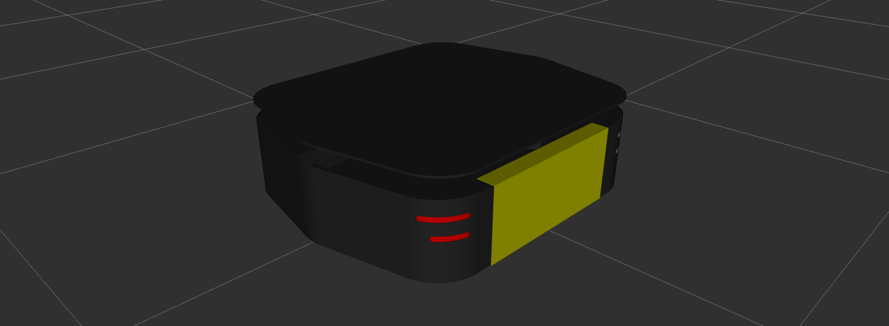

Description Package
====================

The ``ridgeback_description`` package provides a `URDF <http://wiki.ros.org/urdf>`_ model of Ridgeback. 

Ridgeback's URDF model can be visualized in rviz. In terminal, run:

.. code-block:: bash
    roslaunch ridgeback_viz view_model.launch

Accessories
------------

Ridgeback has a suite of optional payloads called accessories. These payloads can be enabled and placed on the robot using environment variables specified at the time the `xacro <http://wiki.ros.org/xacro>`_ is rendered to URDF. Available accessory vars are:

.. raw:: html

  <table><tbody>
    <tr> <td>
<strong>Variable</strong> 
</td>
      <td>
<strong>Default</strong> 
</td>
      <td>
<strong>Description</strong> 
</td>
    </tr>
    <tr>
      <td>
<tt>RIDGEBACK_CONTROL_EXTRAS</tt>
</td>
      <td>
<tt>0</tt>
</td>
      <td>
If <tt>1</tt> then the file specified by <tt>RIDGEBACK_CONTROL_EXRAS_PATH</tt> will be loaded
</td>
    </tr>
    <tr>
      <td>
<tt>RIDGEBACK_CONTROL_EXTRAS_PATH</tt>
</td>
      <td>
<i>undefined</i>
</td>
      <td>
The path to a file containing additional custom controls
</td>
    </tr>
    <tr>
      <td>
<tt>RIDGEBACK_USE_MCU</tt>
</td>
      <td>
<tt>0</tt>
</td>
      <td>
Set to <tt>1</tt> if the robot is equipped with an MCU
</td>
    </tr>
    <tr>
      <td>
<tt>RIDGEBACK_FRONT_HOKUYO_LASER</tt>
</td>
      <td>
<tt>0</tt>
</td>
      <td>
Set to <tt>1</tt> if the robot is equipped with a front-facing Hokuyo LIDAR unit (e.g. UST10)
</td>
    </tr>
    <tr>
      <td>
<tt>RIDGEBACK_FRONT_SICK_LASER</tt>
</td>
      <td>
<tt>0</tt>
</td>
      <td>
Set to <tt>1</tt> if the robot is equipped with a front-facing SICK LIDAR unit
</td>
    </tr>
    <tr>
      <td>
<tt>RIDGEBACK_FRONT_LASER_HOST</tt>
</td>
      <td>
<tt>192.168.131.20</tt>
</td>
      <td>
The IP address of the front-facing LIDAR unit.  If using an S300 sensor, which does not communicate over TCP/IP, see below
</td>
    </tr>
    <tr>
      <td>
<tt>RIDGEBACK_FRONT_S300_LASER</tt>
</td>
      <td>
<tt>0</tt>
</td>
      <td>
Set to <tt>1</tt> if the robot is equipped with a front-facing S300 sensor
</td>
    </tr>
    <tr>
      <td>
<tt>RIDGEBACK_FRONT_S300_LASER_PORT</tt>
</td>
      <td>
<tt>/dev/clearpath/s300_front</tt>
</td>
      <td>
The port that the front-facing S300 is connected to
</td>
    </tr>
    <tr>
      <td>
<tt>RIDGEBACK_REAR_HOKUYO_LASER</tt>
</td>
      <td>
<tt>0</tt>
</td>
      <td>
Set to <tt>1</tt> if the robot is equipped with a rear-facing Hokuyo LIDAR unit (e.g. UST10)
</td>
    </tr>
    <tr>
      <td>
<tt>RIDGEBACK_REAR_SICK_LASER</tt>
</td>
      <td>
<tt>0</tt>
</td>
      <td>
Set to <tt>1</tt> if the robot is equipped with a rear-facing SICK LIDAR unit
</td>
    </tr>
    <tr>
      <td>
<tt>RIDGEBACK_REAR_LASER_HOST</tt>
</td>
      <td>
<tt>192.168.131.21</tt>
</td>
      <td>
The IP address of the rear-facing LIDAR unit.  If using an S300 sensor, which does not communicate over TCP/IP, see below
</td>
    </tr>
    <tr>
      <td>
<tt>RIDGEBACK_REAR_S300_LASER</tt>
</td>
      <td>
<tt>0</tt>
</td>
      <td>
Set to <tt>1</tt> if the robot is equipped with a rear-facing S300 sensor
</td>
    </tr>
    <tr>
      <td>
<tt>RIDGEBACK_REAR_S300_LASER_PORT</tt>
</td>
      <td>
<tt>/dev/clearpath/s300_rear</tt>
</td>
      <td>
The port that the rear-facing S300 sensor is connected to
</td>
    </tr>

    <tr>
      <td>
<tt>RIDGEBACK_MICROTRAIN_IMU</tt>
</td>
      <td>
<tt>0</tt>
</td>
      <td>
Set to <tt>1</tt> if the robot is equipped with a Microstrain IMU
</td>
    </tr>
    <tr>
      <td>
<tt>RIDGEBACK_MICROTRAIN_IMU_LINK</tt>
</td>
      <td>
<tt>upgraded</tt>
</td>
      <td>
Prepended to <tt>_imu_link</tt> to define the link the IMU is physically connected to
</td>
    </tr>
    <tr>
      <td>
<tt>RIDGEBACK_MICROTRAIN_IMU_PORT</tt>
</td>
      <td>
<tt>/dev/microstrain</tt>
</td>
      <td>
The port that the IMU is connected to
</td>
    </tr>
    <tr>
      <td>
<tt>RIDGEBACK_MICROTRAIN_IMU_TOPIC  </tt>
</td>
      <td>
<tt>upgraded</tt>
</td>
      <td>
Prepended to <tt>_imu</tt> to define the topic the IMU publishes to
</td>
    </tr>
    <tr>
      <td>
<tt>RIDGEBACK_MICROSTRAIN_IMU_MOUNT</tt>
</td>
      <td>
<tt>mid</tt>
</td>
      <td>
Prepended to <tt>_mount</tt> to define the mount point that the IMU link is connected to
</td>
    </tr>
    <tr>
      <td>
<tt>RIDGEBACK_MICROSTRAIN_IMU_OFFSET</tt>
</td>
      <td>
<tt>0 0 0</tt>
</td>
      <td>
The XYZ offset of the IMU relative to its mounting point (in meters)
</td>
    </tr>
    <tr>
      <td>
<tt>RIDGEBACK_MICROSTRAIN_IMU_RPY</tt>
</td>
      <td>
<tt>0 0 0</tt>
</td>
      <td>
The Roll/Pitch/Yaw offset of the IMU relative to its mounting point (in radians)
</td>
    </tr>
    <tr>
      <td>
<tt>RIDGEBACK_PS3</tt>
</td>
      <td>
<tt>0</tt>
</td>
      <td>
Set to <tt>1</tt> to enable teleoperation via PS3 controller
</td>
    </tr>
    <tr>
      <td>
<tt>RIDGEBACK_URDF_EXTRAS</tt>
</td>
      <td>
<tt>empty.urdf</tt>
</td>
      <td>
Path to a URDF file with additional modules connected to the robot
</td>
    </tr>
  </tbody></table>
