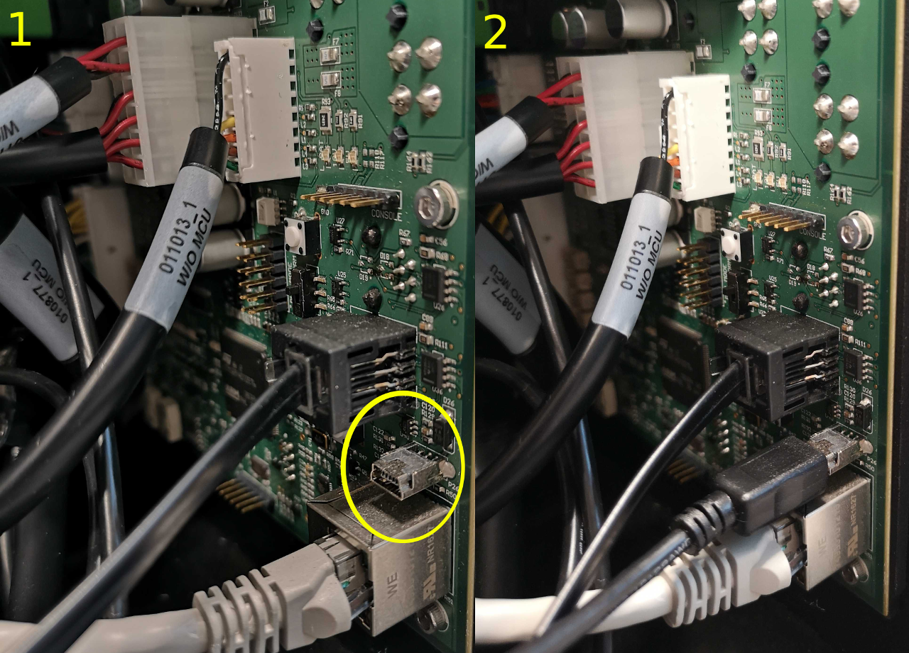
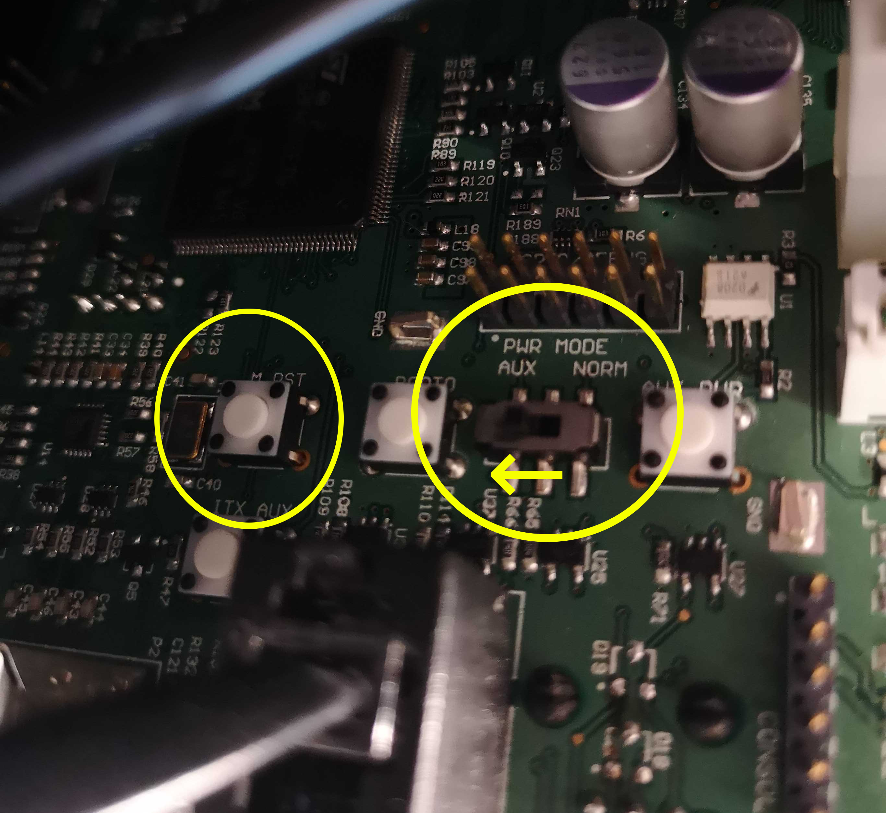

Keeping Ridgeback Updated
==========================

.. note:: If you are upgrading your Ridgeback from an older version of ROS, please refer to `our upgrade instructions here <https://clearpathrobotics.com/assets/guides/noetic/melodic-to-noetic/index.html>`_.

Ridgeback is always being improved, both its own software and the many community ROS packages upon which it depends! You can use the apt package management system to receive new versions all software running on the Ridgeback.

Getting New Packages
--------------------

Each Ridgeback leaves the factory already configured to pull packages from http://packages.ros.org as well as http://packages.clearpathrobotics.com. To update your package and download new package versions make sure that Ridgeback is connected to the internet and run the following commands:

.. code-block:: bash

    sudo apt-get update
    sudo apt-get dist-upgrade

If you see any errors, please `get in touch`_ and we'll see if we can get you sorted out.

.. _get in touch: https://support.clearpathrobotics.com/hc/en-us/requests/new

MCU Firmware Update
-------------------

When you update packages, there is periodically a new version of Ridgeback's firmware available. You will know this
is the case in one of two ways:

1. The firmware and PC are unable to connect to each other, which will be apparent if the two-arrow comms indicator
   fails to come on after system bootup.
2. If the firmware version number in the ``/status`` message does not match the package version output by
   ``dpkg -s ros-melodic-ridgeback-firmware``. In the future there will be an automated check for this which outputs
   a diagnostics warning when a firmware update is available to be applied.

If new firmware is available, follow the below procedure to flash it to Ridgeback's MCU:

1. Place Ridgeback up on blocks. Firmware loading does not usually result in unintended motion, but it's safest when
   off the ground.
2. Ensure that Ridgeback is on and open.
3. Connect the MCU to the Ridgeback's PC using a mini-USB cable connected to the port shown below:

4. In the middle of the MCU is a two-position switch labelled ``PWR MODE``.  Move the switch from the default ``NORM``
   position to the ``AUX`` position.
5. Press the ``M_RST`` button.  The MCU is now in boot-loader mode, ready to receive new firmware

.. note::

    The Ridgeback's MCU is normally rotated 90 degrees when it is installed in the robot; the ``NORM`` position is
    typically towards the top of the robot's chassis and the ``AUX`` position is normally towards the bottom.

Now, from Ridgeback's PC (connected via SSH or screen/keyboard), execute:

.. code-block:: bash

    rosrun ridgeback_firmware upload

You should see about 20 seconds worth of lines output beginning with "Download from image ...".

When the upload is complete, move the ``PWR MODE`` switch back to the ``NORM`` position and immediately press the
``M_RST`` button.

.. note::

    You must press the ``M_RST`` button immediately after changing the mode back to ``NORM``.  If you take too long
    the Ridgeback may power off.  If this happens, simply ensure the switch is in the ``NORM`` position and power
    the robot back on normally.  Losing power in this situation is inconvenient, but not harmful.

After resetting the MCU back in ``NORM`` mode, ensure the MCU is using the new version of the firmware by running

.. code-block:: bash

    rostopic echo /status

and verifying that the MCU firmware version is correct.