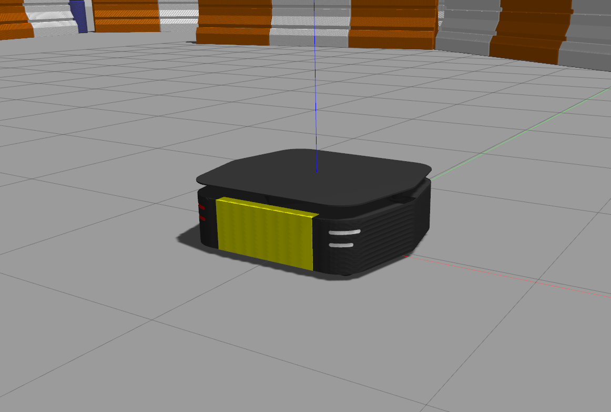
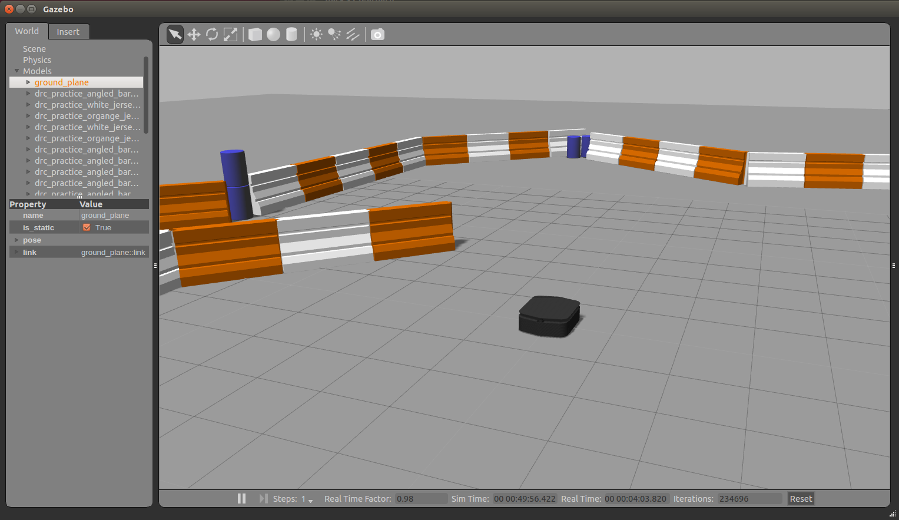
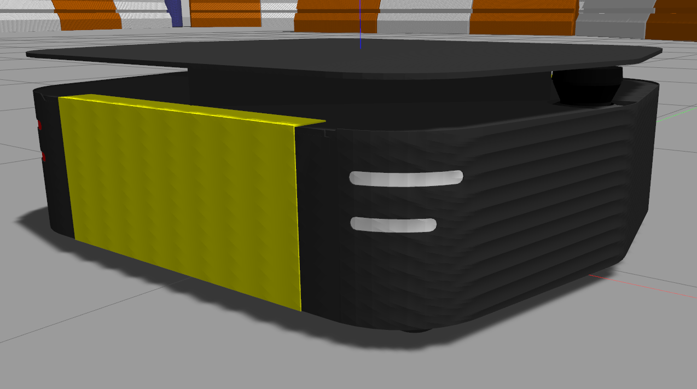
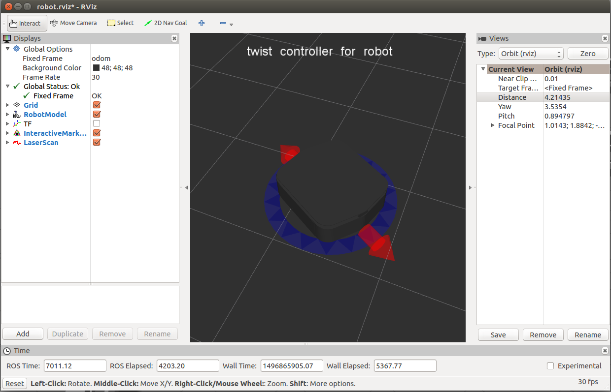
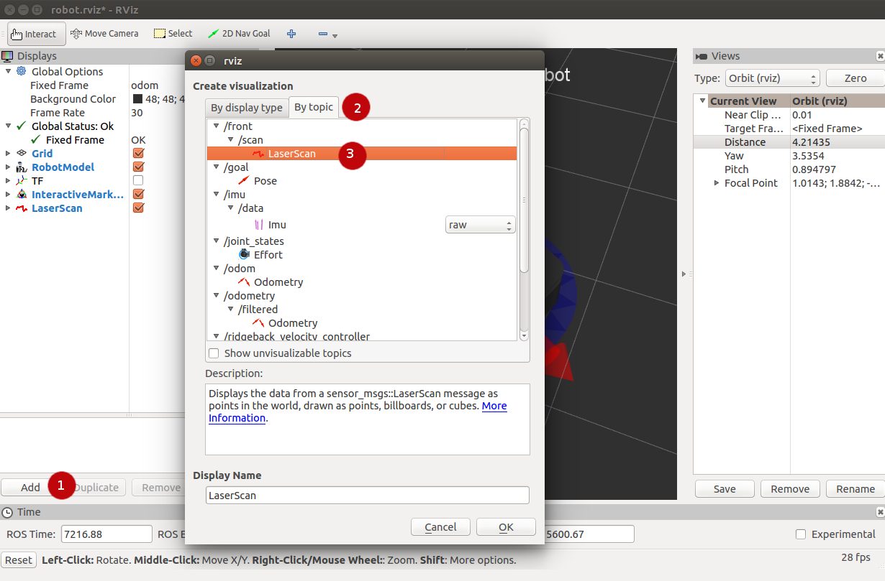
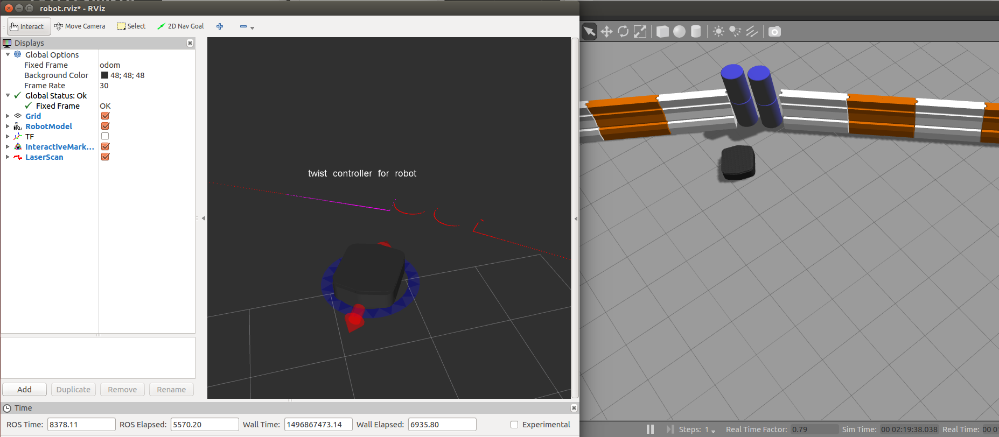

Simulating Ridgeback
====================

Whether you actually have a physical Ridgeback robot or not, the Ridgeback simulator is a great way to get started with ROS robot development. In this tutorial, we will go through the basics of starting Gazebo and rviz and how to drive your Ridgeback around.

.. note::

  Before you can use this tutorial, make sure you have :doc:`installed Ridgeback's software <Installing>`

Launch Gazebo
-------------

Gazebo is a common simulation tool used in ROS. Ridgeback's model in Gazebo include reasonable
approximations of its dynamics, including wheel slippage, skidding, and inertia. To launch a simulated Ridgeback in a simple example world, run the following command:

.. code-block:: bash

    roslaunch ridgeback_gazebo ridgeback_world.launch

You should see the following window appear, or something like it. You can adjust the camera angle by clicking and dragging while holding CTRL, ALT, or the shift key:

The window which you are looking at is the Gazebo Client. This window shows you the "true" state of the simulated world which the robot exists in. It communicates on the backend with the Gazebo Server, which is doing the heavy lifting of actually maintaining the simulated world. At the moment, you are running both the client and server locally on your own machine, but some advanced users may choose to run heavy duty simulations on separate hardware and connect to them over the network.

.. note::

    When simulating, you must leave Gazebo running. Closing Gazebo will prevent other tools, such as rviz (see below) from working correctly.

**Simulation Configs**

Note that like Ridgeback itself, Ridgeback's simulator comes in multiple flavours called configs. A common one which you will need often is the ``base_sick`` config. If you close the Gazebo window, and then CTRL-C out of the terminal process, you can re-launch the simulator with a specific config:

.. code-block:: bash

    roslaunch ridgeback_gazebo ridgeback_world.launch config:=base_sick

You should now see the simulator running with the simulated SICK LMS111 laser present:

Gazebo not only simulates the physical presence of the laser scanner, it also provides simulated data which reflects the robot's surroundings in its simulated world. We will visualize the simulated laser scanner data shortly.

Launch rviz
-----------

The next tool we will encounter is :roswiki:`rviz`. Although superficially similar in appearance to Gazebo, rviz has a very different purpose. Unlike Gazebo, which shows the reality of the simulated world, rviz shows the robot's *perception* of its world, whether real or simulated. So while Gazebo won't be used with your real Ridgeback, rviz is used with both.

You can using the following launch invocation to start rviz with a pre-cooked configuration suitable for visualizing any standard Ridgeback config:

.. code-block:: bash

    roslaunch ridgeback_viz view_robot.launch

You should see rviz appear:

The rviz display only shows what the robot knows about its world, which presently, is nothing. Because the robot doesn't yet know about the barriers which exist in its Gazebo world, they're not shown here.

Driving with Interactive Controller
------------------------------------

Rviz will also show Ridgeback's interactive markers around your Ridgeback's model. These will appear as a blue ring and red arrows. Depending on your robot, there will also be green arrows. If you don't see them in your rviz display, select the Interact tool from the top toolbar and they should appear. 

Drag the red arrows in rviz to move in the linear x direction, and the blue circle to move in the angular z direction. If your robot supports lateral/sideways movement, you can drag the green arrows to move in the linear y direction. Rviz shows you Ridgeback moving relative to its odometric frame, but it is also moving relative to the simulated world supplied by Gazebo. If you click over to the Gazebo window, you will see Ridgeback moving within its simulated world. Or, if you drive real Ridgeback using this method, it will have moved in the real world.

Visualizing Sensors
-------------------

The rviz tool is capable of visualizing many common robotic sensors, as well as other data feeds which can give us clues as to what the robot is doing and why. A great place to start with this is adding the :roswiki:`LaserScan <rviz/DisplayTypes/LaserScan>` plugin to visualize the laser scans being produced by the simulated LMS111. In the left panel, click the "Add" button, then select the "Topics" tab, and then select the ``front/scan`` topic:

Click OK, and you should see laser scan points now visible in the rviz window, relative to the robot:

If you use the interactive markers to drive around, you'll notice that the laser scan points move a little bit but generally stay where they are. This is the first step toward map making using :roswiki:`gmapping`, which is covered in the next tutorial, :doc:`Navigating`.