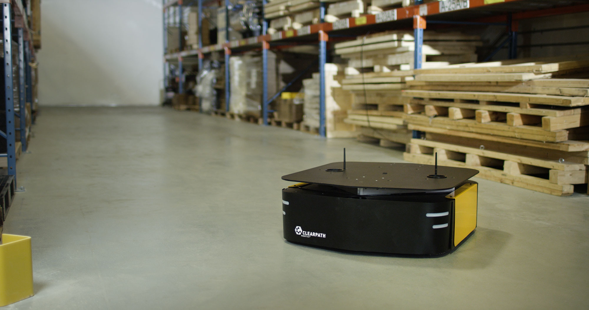

Ridgeback Tutorials
===================

This package supplies Sphinx-based tutorial content to assist you with setting up and operating your Ridgeback_ mobile robot. The tutorials topics are listed in the left column, and presented in the suggested reading order.

.. _Ridgeback: https://clearpathrobotics.com/ridgeback-indoor-robot-platform/

.. Warning::
  These tutorials assume that you are comfortable working with ROS.  We recommend starting with our
  `ROS tutorial <./../ros>`_ if you are not familiar with ROS already.

.. note::

  These tutorials specifically target Ridgeback robots running Ubuntu 20.04 with ROS Noetic, as it is the standard OS environment for Ridgeback. If instead you have an older Ridgeback robot running Ubuntu 18.04 with ROS Melodic, please follow `this tutorial <https://www.clearpathrobotics.com/assets/guides/melodic/melodic-to-noetic/index.html>`_ to upgrade its OS environment to Ubuntu 20.04 with ROS Noetic.

:doc:`Simulation <Simulating>` is a logical place for most users to start, as this is universally applicable; understanding how to effectively operate Ridgeback in simulation is valuable whether you are in the testing phase with software you intend to ultimately deploy on a real Ridgeback, or you do not have one and are simply exploring the platform's capabilities.

:doc:`Driving <Driving>` covers how to teleoperate Ridgeback using the remote control, a well as safety procedures for operating the real robot. Anyone working with a physical robot should be familiar with this section.

:doc:`Navigation <Navigating>` is a follow-on to what is learned in the simulation tutorial, as navigation and map-making may be run in the simulated environment. However, this content is applicable to both the simulator and the real platform, if equipped with a laser scanner.

The remainder of the subjects are more applicable to the real robot, and have to do with configuring, using, and maintaining the platform. If you are a lab administrator rather than direct platform user, you may wish to skip the introductory chapters and jump straight to these ones.

.. toctree::
    :maxdepth: 0
    :caption: Ridgeback Overview

    Introduction <self>
    StatusIndicators

.. toctree::
    :maxdepth: 0
    :caption: Ridgeback ROS Packages

    CommonPackages
    DescriptionPackage

.. toctree::
    :maxdepth: 0
    :caption: Setting Up Ridgeback

    Installing
    Networking
    PairingController

.. toctree::
    :maxdepth: 0
    :caption: Using Ridgeback

    Driving
    Simulating
    Navigating
    ExtendingStartup
    KeepingUpdated

.. toctree::
    :maxdepth: 0
    :caption: Hardware Customization

    CustomComputer
    Payloads
    Manipulation

.. toctree::
    :titlesonly:
    :hidden:
    :caption: Testing Ridgeback
    
    RidgebackTests

.. toctree::
    :titlesonly:
    :hidden:
    :caption: Other

    AdditionalSimulation