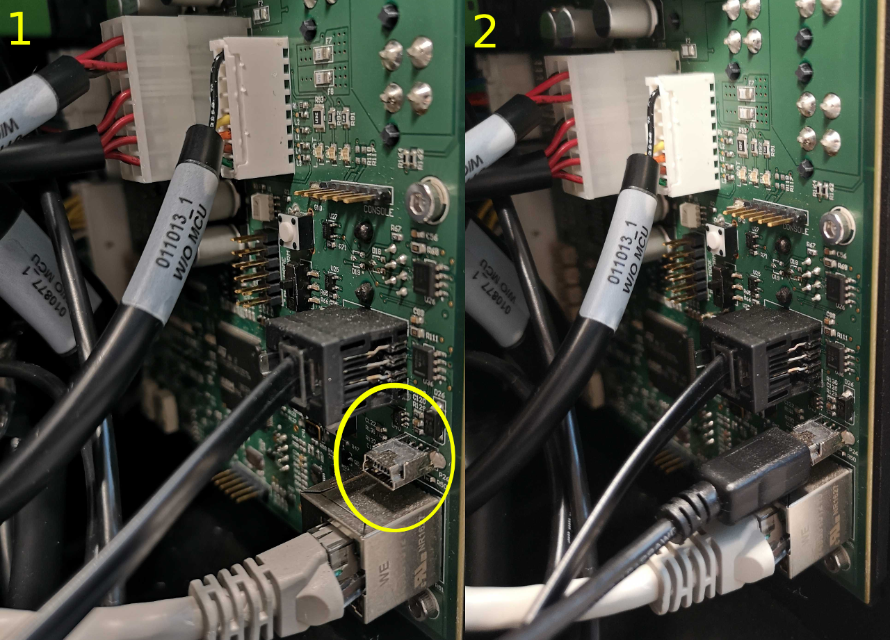
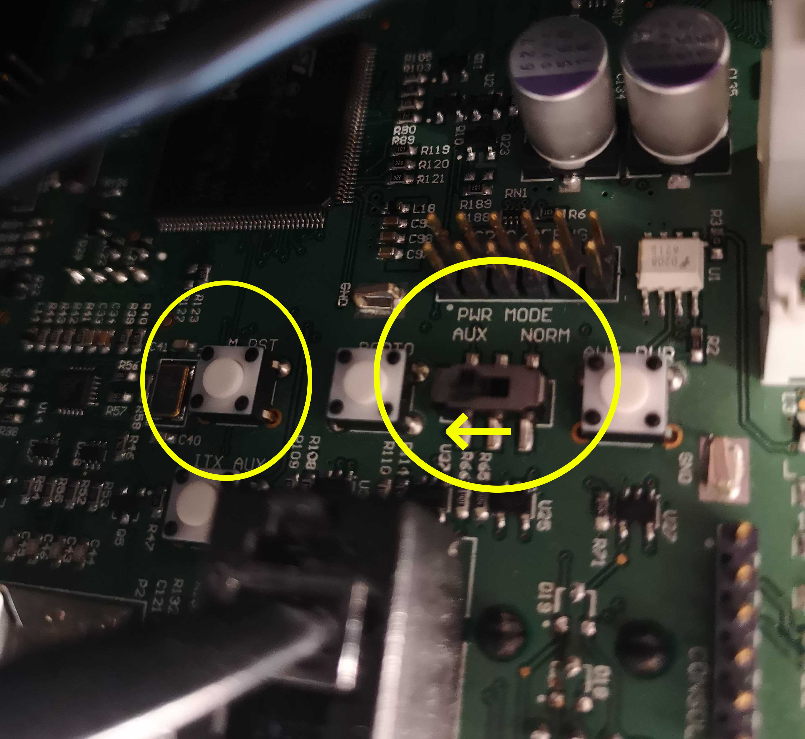

Keeping Ridgeback Updated
=========================

.. note:: If you are upgrading your Ridgeback from an older version of ROS, please refer to `our upgrade instructions here <https://clearpathrobotics.com/assets/guides/kinetic/kinetic-to-melodic/index.html>`_.

Ridgeback is always being improved, both its own software and the many community ROS packages upon which it
depends! You can use the apt package management system to receive new versions all software running on the
platform.

Getting New Packages
--------------------

Each Ridgeback leaves the factory already configured to pull packages from http://packages.ros.org as well as
http://packages.clearpathrobotics.com. To update your package and download new package versions, simply run:

.. code-block:: bash

    sudo apt-get update
    sudo apt-get dist-upgrade

If you see any errors, please `get in touch`_ and we'll see if we can get you sorted out.

.. _get in touch: https://support.clearpathrobotics.com/hc/en-us/requests/new

MCU Firmware Update
-------------------

When you update packages, there is periodically a new version of Ridgeback's firmware available. You will know this
is the case in one of two ways:

1. The firmware and PC are unable to connect to each other, which will be apparent if the two-arrow comms indicator
   fails to come on after system bootup.
2. If the firmware version number in the ``/status`` message does not match the package version output by
   ``dpkg -s ros-melodic-ridgeback-firmware``. In the future there will be an automated check for this which outputs
   a diagnostics warning when a firmware update is available to be applied.

If new firmware is available, follow the below procedure to flash it to Ridgeback's MCU:

1. Place Ridgeback up on blocks. Firmware loading does not usually result in unintended motion, but it's safest when
   off the ground.
2. Ensure that Ridgeback is on and open.
3. Connect the MCU to the Ridgeback's PC using a mini-USB cable connected to the port shown below:

4. In the middle of the MCU is a two-position switch labelled ``PWR MODE``.  Move the switch from the default ``NORM``
   position to the ``AUX`` position.
5. Press the ``M_RST`` button.  The MCU is now in boot-loader mode, ready to receive new firmware

.. note::

    The Ridgeback's MCU is normally rotated 90 degrees when it is installed in the robot; the ``NORM`` position is
    typically towards the top of the robot's chassisand the ``AUX`` position is normally towards the bottom.

Now, from Ridgeback's PC (connected via SSH or screen/keyboard), execute:

.. code-block:: bash

    rosrun ridgeback_firmware upload

You should see about 20 seconds worth of lines output beginning with "Download from image ...".

When the upload is complete, move the ``PWR MODE`` switch back to the ``NORM`` position and immediately press the
``M_RST`` button.

.. note::

    You must press the ``M_RST`` button immediately after changing the mode back to ``NORM``.  If you take too long
    the Ridgeback may power off.  If this happens, simply ensure the switch is in the ``NORM`` position and power
    the robot back on normally.  Losing power in this situation is inconvenient, but not harmful.

After resetting the MCU back in ``NORM`` mode, ensure the MCU is using the new version of the firmware by running

.. code-block:: bash

    rostopic echo /status

and verifying that the MCU firmware version is correct.

.. _scratch:

Starting From Scratch
---------------------

If Ridgeback's computer has become inoperable, or for any reason you want to restore it to the factory state, begin
by opening Ridgeback, lowering the computer tray, and connecting a screen and keyboard, as well as a wired internet
connection. You can then download the most recent version of the Ridgeback boot ISO from the following location:

https://packages.clearpathrobotics.com/stable/images/latest/

Use unetbootin or a similar tool to flash the ISO image to a USB memory stick. Boot Ridgeback's computer with the USB
memory connected, and you should be in the purple Debian/Ubuntu installer. The installer runs by itself and shuts
down the computer when finished.

Once done, turn Ridgeback on once more, and run the following:

.. code-block:: bash

    rosrun ridgeback_bringup install

This installs Ridgeback's `robot_upstart`_ job, so that ROS starts each time the robot starts.

.. _robot_upstart: http://wiki.ros.org/robot_upstart

Note that if you may need to re-pair your gamepad to the robot, and you'll have some extra work to do if you have
integrated accessories which require additional launchers or URDF.

Bluetooth Controller Pairing
----------------------------

**PS3 Controller Pairing**

If your Sixaxis controller runs out of batteries, or you purchase a new one, you might want to re-pair your platform
and controller. To do this, lower the computer tray and plug the controller into an available USB port using a
standard Mini-B USB cable. Then, from the prompt, run:

.. code-block:: bash

    sudo sixpair

You should see a notice that the MAC address of Ridgeback's bluetooth adapter has been written into the controller. Now
disconnect the USB cable and you should be able to press the pair button and achieve a pairing. Note that this first
pairing *may* cause the joystick to come up as ``/dev/input/js1`` rather than ``/dev/input/js0``. If Ridgeback does not
respond to your commands, power-cycle the full system and you should be set.

**PS4 Controller Pairing**

1. The first step is to check if Sixad is installed using: ``dpkg -l sixad`` which should return with to packages found.

      - If you have sixad installed then it needs to be removed using ``sudo apt-get purge sixad``

2. Charge the controller for a while, the controllers sometimes have issues pairing when the battery is low.
3. Unpair the controller using ``sudo bluez-test-device remove XX:XX:XX:XX:XX:XX`` (You can get this by putting the controller into to pairing mode and running hcitool scan).
4. Check to make sure Bluetooth is enabled by running ``sudo service bluetooth status``.
5. If bluetooth is not enabled start the Bluetooth daemon with ``sudo service bluetooth start`` and make sure the bluetoothd is executable with ``ls -la /usr/sbin/bluetoothd``. If not make it executable using ``sudo chmod +x /usr/sbin/bluetoothd`` but this a temporary solution, you should update your packages to fix this.
6. Power cycle the controller before trying to pair it.
7. Finally, press the PS and share button simultaneously so the controller Bluetooth is enabled for pairing and use ``sudo ds4drv-pair``.
